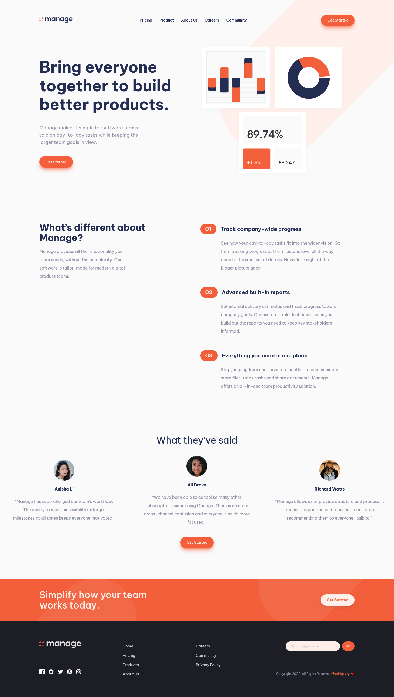
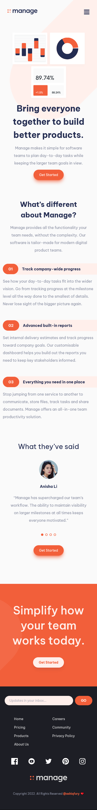

# Frontend Mentor - Manage landing page solution

This is a solution to the [Manage landing page challenge on Frontend Mentor](https://www.frontendmentor.io/challenges/manage-landing-page-SLXqC6P5). Frontend Mentor challenges help you improve your coding skills by building realistic projects.

## Table of contents

- [Overview](#overview)
  - [The challenge](#the-challenge)
  - [Screenshot](#screenshot)
  - [Links](#links)
  - [Built with](#built-with)
- [Author](#author)

## Overview

### The challenge

Users should be able to:

- View the optimal layout for the site depending on their device's screen size
- See hover states for all interactive elements on the page
- See all testimonials in a horizontal slider
- Receive an error message when the newsletter sign up `form` is submitted if:
  - The `input` field is empty
  - The email address is not formatted correctly
- Page transitions

### Screenshot

- ### Desktop

  

- ### Mobile
  

### Links

- Solution URL: [Add solution URL here](https://github.com/ashiqfury/ashiqfury.github.io/tree/master/frontend-mentor/blogr-landing-page)
- Live Site URL: [Add live site URL here](https://ashiqfury.github.io/frontend-mentor/manage-landing-page)

## My process

### Built with

- Semantic HTML5 markup
- CSS custom properties
- Flexbox
- Mobile-first workflow
- [TailwindCSS](https://tailwindcss.com/) - CSS Library
- [Gsap](https://greensock.com/gsap/) - Animaiton Library

## Author

- Instagram - [@\_a.s.h.i.q\_\_f.u.r.y\_](https://www.instagram.com/_a.s.h.i.q__f.u.r.y_/)
- Frontend Mentor - [@ashiqfury](https://www.frontendmentor.io/profile/ashiqfury)
- Twitter - [@ashiqfury](https://www.github.com/ashiqfury)
